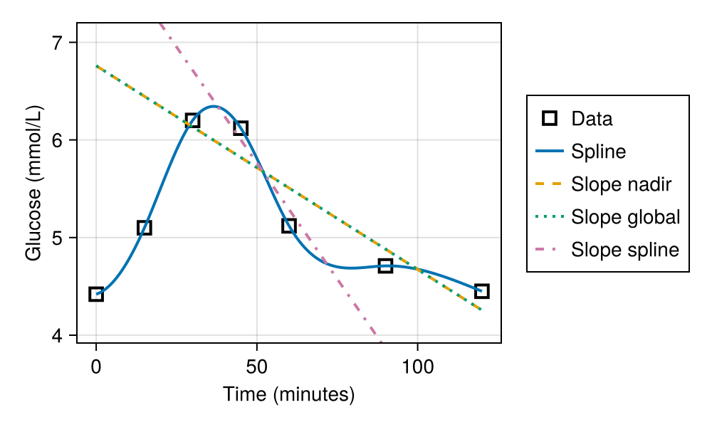
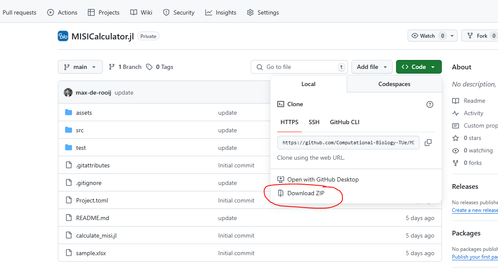
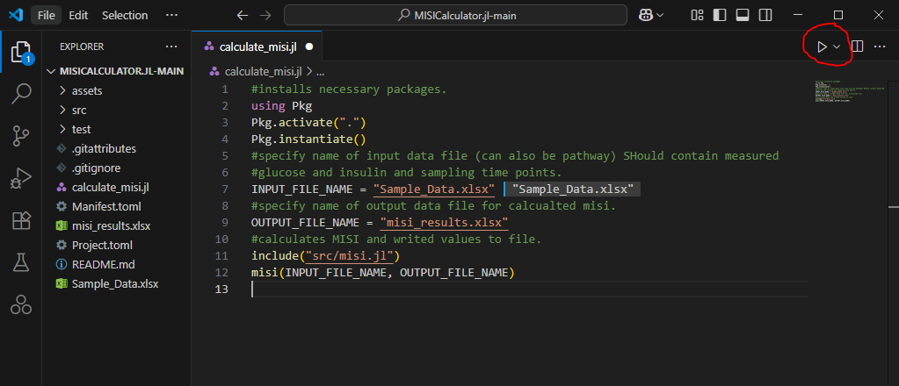

  

# MISICalculator.jl
This is a Julia package for calculating the Muscle Insulin Sensitivity Index (MISI) from glucose and insulin data from an oral glucose tolerance test (OGTT). The code is based on the work and the [MATLAB GUI](https://github.com/shauna-odonovan/MISI-Calculator) of O’Donovan et al. [^1]. 



> [!CAUTION]
> This package is still fully under construction and not all features are implemented yet. The API is not stable and may change drastically in the future. Please use with caution. 

## Instructions
</div>

## Julia Installation and Environment Setup
Here you will find some instructions on how to make sure the code from this repository can run on your computer. The workshop is built to fully work with Julia version 1.9. In this instruction, we will assume you are installing Julia 1.9, but any other version is installed in a similar way. 


### Installing Julia using the Julia version manager (juliaup) (recommended)
The first step is to install the Julia version manager (`juliaup`), which enables you to have multiple Julia versions installed on your machine. This step is not mandatory for a properly working version of Julia, but it is useful if you are planning to use Julia for your own projects in the future.

**Windows**:

>  **Note**
>  The `winget` command may not be available on your machine! In that case, you can download Julia from the Microsoft Store. If your organization prevents use of the Microsoft Store, you can follow the download instructions from https://julialang.org when clicking `Download`

Open your favorite terminal, or press `Win`+`R`, type `cmd` in the text bar and press 'run'.
```
winget install julia -s msstore
```

**Linux & MacOS**:

From the command line execute
```
curl -fsSL https://install.julialang.org | sh
```
---

Afterwards, you can restart the terminal environment. You can install a specific version of Julia using
```
juliaup add <version>
```

You can list the versions available to you using
```
juliaup list
```

We recommend to start with installing the latest stable version, dubbed `release` by running
```
juliaup add release
```

If this is your only Julia version, juliaup will automatically label this as the default version. 

---

### Setting up VSCode
Julia was found to work the best using the VSCode IDE, which you can download [here](https://code.visualstudio.com/download). After downloading and installing VSCode, navigate to the VSCode marketplace, which has the following icon:


Type `Julia` in the search bar and install the Julia Language Support extension. 

---

### Setting up the workshop environment
After installing Julia, you can either fork this repository to your own Github account and download the code from there, or download the code directly from this repository into a Zip-file by selecting `Code` -> `Download ZIP`. 

Put the workshop code in a nice folder and open this folder from VSCode.

Now there are two ways to initialize the environment. 

#### 1. Use the first code block in the 01-Getting-Started file
Uncomment the first code block in the `01-Getting-Started.ipynb` file to automatically set up the environment.

#### 2. Use the VSCode terminal

In case a terminal is not open yet, click `Terminal`->`New Terminal` from the top bar and execute
```
julia
```
To start the Julia REPL.

Then, press `]` to change from Julia to the package manager, which is indicated by `>julia` changing to `>pkg`. Then, execute:
```
activate .
```
>  **Warning**
> Make sure to remember the dot `.` at the end of this command.

To activate the workshop environment. Then execute (also from the Pkg terminal)
```
instantiate
```

To install all the required packages. You should now be able to run all the notebooks in this workshop environment.

---

### Troubleshooting

#### Error opening notebooks in Windows VS Code
In Windows, we noticed that notebooks may sometimes error when trying to open them in Visual Studio Code. This has to do with the path length limit in the Windows filesystem. The easiest fix is to place the repository folder in a directory that is higher up, so the paths will not be too long. 

 # Download MISI Calculator
 

You can download this GitHub repository  by clicking on the green CODE button and selecting Download ZIP. and open it in Visual Studio Code. 



Extract the files in this folder and naviage to the folder location in Visual Studio Code interface by selecting 'Open Folder' in the File Tab. 

Open the `calculate_misi.jl` file and edit the `INPUT_FILE_NAME` and `OUTPUT_FILE_NAME` variables to match your desired files. Then, run the file by pressing `F5` or by clicking on the "Run" button in the top right corner of the editor (red circle).



> [!IMPORTANT]
> Make sure your input file is an Excel file that is formatted in the same way as the example file: `Sample_Data.xlsx`.

## References
[^1]: O’Donovan, S. D. et al. Improved quantification of muscle insulin sensitivity using oral glucose tolerance test data: the MISI Calculator. Sci Rep 9, 9388 (2019).

